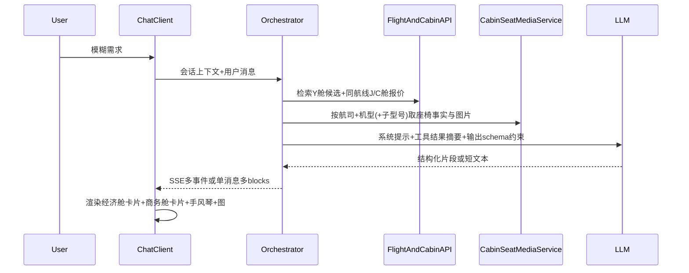

# 对话流商务舱推荐

**产品需求文档（PRD）**

| 项 | 内容 |
| --- | --- |
| 文档状态 | 已定稿（可与研发对齐实现） |
| 关联设计 | [high-cabin-purchase-task.md](./high-cabin-purchase-task.md) 数据池与展示约束 |
| 修订说明 | 由架构方案整理为 PRD：补充目标/范围/验收与需求编号 |
| **PDF / 打印版** | 同目录 [`如何在对话流商务舱推荐_4ea05d0c.pdf`](./如何在对话流商务舱推荐_4ea05d0c.pdf)（由 [`如何在对话流商务舱推荐_4ea05d0c.print.html`](./如何在对话流商务舱推荐_4ea05d0c.print.html) 经 Chrome 无头导出，A4、无页眉页脚） |

重新生成 PDF（需在 macOS 且已安装 Google Chrome）：

```bash
cd "/Users/dengxinyang/Desktop/AI·Project/D2C/Qwen"
HTML_URI=$(python3 -c "import pathlib; print(pathlib.Path('如何在对话流商务舱推荐_4ea05d0c.print.html').resolve().as_uri())")
PDF_OUT=$(python3 -c "import pathlib; print(pathlib.Path('如何在对话流商务舱推荐_4ea05d0c.pdf').resolve())")
"/Applications/Google Chrome.app/Contents/MacOS/Google Chrome" \
  --headless=new --disable-gpu --no-pdf-header-footer \
  --print-to-pdf="$PDF_OUT" "$HTML_URI"
```

---

## 1. 摘要（TL;DR）

在 **AI 对话流** 中推荐机票时，**不得**依赖大模型凭空描述机型、座椅、图片 URL。应由 **编排层并行检索** 经济舱与商务舱报价，由 **CabinKB** 提供可校验事实与图片地址，通过 **结构化消息块（typed blocks）** 下发；客户端渲染 **经济舱卡片 + 商务舱 upsell 槽位**（含手风琴与配图）。LLM 仅输出 **短导购文案**，并遵守 schema，**不编造**舱位参数与媒体链接。

---

## 2. 背景与要解决的问题

| 问题 | 说明 |
| --- | --- |
| 模型幻觉 | 大模型不具备你们积累的机型、布局、实拍图知识，自由发挥会产生错误信息与合规风险。 |
| 职责混乱 | 报价、库存、事实数据必须由业务系统提供；模型只做意图理解与话术串联。 |
| 体验目标 | 用户在经济舱方案后，能稳定看到「第三方案」商务舱 upsell（有票、策略允许时），并可通过折叠区查看 **可溯源事实 + 官方图片**。 |

---

## 3. 目标与非目标

### 3.1 产品目标

1. **可控推荐**：商务舱是否出现、排序先后由 **编排策略 + 库存 + 价差规则** 决定，不完全依赖提示词。
2. **事实一致**：座椅、尺寸、评分、图片等仅来自 **CabinKB / 报价服务**，缺失时 UI **显式占位**，禁止模型补写。
3. **可度量**：曝光、点击、转化可埋点归因；事实字段可对黄金集抽检。

### 3.2 非目标（本期不做或不限定）

- 不规定具体大模型品牌与精调方案。
- 不替代完整机票交易闭环细节（支付、退改规则等以各端现有能力为准）。
- 自动化 E2E 测试工具（如 gstack）为 **可选回归手段**，不作为本 PRD 交付物。

---

## 4. 用户与典型场景

| 场景 ID | 描述 | 期望行为 |
| --- | --- | --- |
| S1 | 用户模糊说「帮我订去北京的票」 | 并行拉 Y + J/C；有商务舱库存且策略通过时展示第三槽 upsell。 |
| S2 | 用户表达舒适/老人/红眼/出差等 | 提高商务舱排序权重、放宽第三槽价差阈值（见 §6.2）。 |
| S3 | 用户强调最便宜、学生、预算有限 | 降权或隐藏第三槽，避免强推商务舱。 |
| S4 | 用户展开商务舱方案下的折叠区 | 展示机型/舱位事实列表与 **HTTPS 图片**（域名白名单）。 |

---

## 5. 需求总表

优先级：**P0** 必须上线；**P1** 强烈建议；**P2** 可迭代。

| ID | 需求简述 | 优先级 |
| --- | --- | --- |
| FR-01 | 编排层对解析后的 OD/日期 **并行** 检索经济舱 TopN 与商务舱可售报价 | P0 |
| FR-02 | 仅 **有库存** 的商务舱方案可进入展示候选；第三槽是否露出由 **价差 + 策略** 决定 | P0 |
| FR-03 | 按固定槽位模板输出（如方案一/二 Y，方案三 J/C），结构不与模型「即兴」绑定 | P0 |
| FR-04 | 基于用户文本计算 **倾向分 B**，参与商务舱排序与第三槽策略（§6.2） | P1 |
| FR-05 | 流式协议支持 **文本增量 + 结构化 block**（如 FlightCard、CabinUpsell） | P0 |
| FR-06 | 图片仅下发 **己方 CDN/OSS HTTPS**（或短期签名 URL），**禁止**模型生成 URL | P0 |
| FR-07 | CabinKB 以航司+机型(+子型号) 返回事实字段；缺失时返回可识别占位，前端展示「暂无可靠数据」类文案 | P0 |
| FR-08 | 客户端：方案卡片 + 商务舱下 **Accordion** + 大图与要点；默认展开一条主折叠 | P1 |
| FR-09 | CTA「查看更多商务舱优选」带 `search_id`、`offer_id`（或等价）便于归因 | P1 |
| FR-10 | Block **Schema 校验**；禁止任意 HTML 注入；图片 **域名白名单** | P0 |
| FR-11 | 埋点：第三槽曝光、卡片/CTA 点击、转化；事实错误率抽检 | P1 |

---

## 6. 功能说明

### 6.1 系统数据流（逻辑架构）



**验收要点**：同一轮回答中，卡片与 Cabin 事实可与文本块 **按序或按 block_id 绑定**，客户端不得在 payload 未完整时渲染半块卡片（避免闪烁与错位）。

### 6.2 商务舱倾向分 `B`（关键词规则，无 LLM）

**适用范围**：对 **当前用户句** 匹配（可选叠加 **上一轮一句**）。用于商务舱候选排序与第三槽曝光，**不调用大模型**。

| 步骤 | 规则 |
| --- | --- |
| 初始化 | `B = 0` |
| 加分 | 下表四类，**每类命中任意一词仅计一次** |
| 减分 | **预算敏感** 整轮计 **一次**：命中「最便宜、低价、学生、预算、省钱、特价、穷游」等 → `B -= 35` |
| 截断 | `B = clamp(B, -40, 80)` |
| 排序 | 商务舱方案业务分 `R0`（价格/时长/直飞/库存等，建议 0～100 量级），`R = R0 + w × B`，**`w ∈ [0.3, 0.6]`**（非百分制 `R0` 时同比缩放 `w`） |
| 第三槽 | 有 J/C 库存时：`B ≥ 20` 优先展示并**可放宽价差阈值**；`-20 < B < 20` 走默认价差策略；`B ≤ -20` **隐藏或强降级**第三槽 |

**加分表（每类最多 +1 次）**

| 类别 | 示例词（可扩展同义词） | 分值 |
| --- | --- | --- |
| 舒适 | 舒服、舒适、躺平、不想太累、宽敞、睡得好 | +25 |
| 人群 | 老人、父母、长辈、带娃、小孩、孕妇 | +25 |
| 红眼疲劳 | 红眼、夜班、凌晨、早班、长途、十几个小时、国际 | +20 |
| 商务场景 | 出差、报销、见客户、会议（同一类，只加一次） | +15 |

**实现注意**：同类多词不重复加分；「出差 / 报销」同属商务场景，合计 **+15**。

### 6.3 事实与图片进入对话的三种实现路径

| 方案 | 做法 | 适用 |
| --- | --- | --- |
| **A（首选）** | 流式协议除 `text` 外下发 `flight_card`、`cabin_detail`、`image_gallery`、`accordion` 等 JSON block | 可控性最高，强绑定 UI |
| **B** | LLM Function Calling：`get_cabin_facts(...)` 返回严格 JSON，再注入上下文 | 与工具调用生态一致 |
| **C** | 服务端模板拼装卡片与图，模型只出短导语 | 模型最不易越权，灵活度略低 |

**图片字段建议**：`url`（HTTPS）、`alt`、可选 `width`/`height`、`content_hash`（缓存）。

### 6.4 前端信息架构（IA）

- **每个方案**：标题 + 一句推荐 + **机票卡片**。
- **商务舱方案**：卡片下 **Accordion**（机型详情、舱位卖点、娱乐系统等）；展开区 **大图 + 要点列表**。
- **默认交互**：默认展开「豪华商务舱」相关一条，其余折叠。
- **转化**：底部 CTA 跳转列表/deep link，参数含 `search_id`、`offer_id`（或产品统一归因字段）。

文案与事实类型与 [high-cabin-purchase-task.md](./high-cabin-purchase-task.md) 第 3 节对齐。

### 6.5 流式协议（建议）

| 事件/块类型 | 用途 |
| --- | --- |
| `message.delta` | 纯文本导购（宜短） |
| `message.block` + `FlightCard` | 机票结构化展示 |
| `message.block` + `CabinUpsell` | `accordion`、`images`、`facts` 等 |

**安全**：Schema 校验；禁止模型直出 HTML；图片域名白名单。

---

## 7. 非功能需求

| ID | 说明 |
| --- | --- |
| NFR-01 | **合规**：不出现未经验证的舱位参数与外链图片。 |
| NFR-02 | **一致性**：同一 `search_id` 下展示报价与跳转落地页逻辑一致（以产品规范为准）。 |
| NFR-03 | **可测试**：关键 UI 路径可被 headless 或手工用例覆盖（折叠、懒加载、CTA）。 |

---

## 8. 成功指标与埋点

| 指标 | 说明 |
| --- | --- |
| 曝光率 | 模糊 query 下第三槽展示率；**有库存时**展示率 |
| CTR | 商务舱卡片、「查看更多」点击 |
| 转化 | 下单、升舱、客单价（与数据团队口径对齐） |
| 质量 | 相对 CabinKB **黄金集**的事实错误率；用户举报量 |

---

## 9. 依赖与数据来源

- **内部**：FlightAndCabinAPI（报价与库存）、CabinKB（机型/座椅/图）。
- **外部能力（可选）**：旅行搜索类 Skill（如 Fly.ai）；第三方航班检索 API（如 SerpAPI Google Flights 等）——**密钥与 endpoint 仅配置于服务端环境变量，禁止写入仓库或 PRD 正文**。

---

## 10. 里程碑建议

1. 对齐 **FlightCard / CabinUpsell** JSON Schema 与 SSE（或等价）事件名。
2. 落地 **Orchestrator**：并行查价、CabinKB 拉取、槽位与 **B 分**策略。
3. 提示词约束：**短文案 + block 引用**，不编造参数与 URL。
4. 客户端：手风琴、图片、埋点、白名单。
5. 小流量实验 + 关键路径回归。

---

## 11. 术语

| 术语 | 含义 |
| --- | --- |
| Y / J / C | 经济舱 / 商务舱 / 头等（以 IATA 惯例简称，实际以接口舱等为准） |
| Orchestrator | 对话编排服务：检索、拼装 block、调用 LLM |
| CabinKB | 航司+机型(+子型号) → 事实字段与图片 URL 的知识服务 |
| 第三槽 | 固定模板中的「舒适出行」商务舱 upsell 展示位 |

---

## 12. 附录：需求验收核对（抽检清单）

- [ ] 无库存时不出现可订商务舱卡片（或显示与产品一致的「售罄/无票」态）。
- [ ] 任意展示的图片 URL 均来自白名单域名；响应中无模型生成的 `http(s)://` 图片字段。
- [ ] CabinKB 缺字段时 UI 有占位，无模型补全的长篇参数描述。
- [ ] 输入含「最便宜」类词时，第三槽行为符合 `B ≤ -20` 策略。
- [ ] 输入含「红眼 + 老人」等组合时，`B` 计算符合「每类一次」规则且排序分 `R` 可解释。

---

## 13. SPEC：千问高舱/升舱推荐模块

> 本区段由深度访谈结论 + B777-300 机型数据沉淀而成。模块设计稿见 `pencil-new.pen` 节点 `roFkg`（`Mod_UpsellRecommend_B777`）。

### 13.1 字段清单

| 字段 | 来源 | 类型 | 必填 | 说明 |
|------|------|------|------|------|
| `aircraft.family` | CabinKB | string | Y | 机型代号，如 `B777-300` |
| `aircraft.operator` | CabinKB | string | Y | 航司名，如 `国泰航空` |
| `aircraft.config_versions` | CabinKB | int | Y | 配置版本数（1 = 无歧义） |
| `aircraft.first_flight_year` | CabinKB | int | N | 首飞年份，用于弱化老旧风险提示 |
| `cabins[].class` | CabinKB | enum | Y | `economy` / `business` / `first` |
| `cabins[].seat_count` | CabinKB | int | N | 座位数 |
| `cabins[].pitch` | CabinKB | string | Y | 腿距，如 `45" (114cm)` |
| `cabins[].width` | CabinKB | string | N | 椅宽，如 `21" (53cm)` |
| `cabins[].recline` | CabinKB | string | Y | 可调角度，如 `180° 全平躺` |
| `cabins[].layout` | CabinKB | string | N | 布局，如 `2-2-2` |
| `cabins[].amenities[]` | CabinKB | string[] | N | 配套设施列表 |
| `rating.overall` | CabinKB | float | N | 综合评分，如 `4.62` |
| `rating.review_count` | CabinKB | int | N | 评论数，如 `294` |
| `rating.positive_pct` | CabinKB | float | N | 正面率，如 `0.93` |
| `reviews.positive[]` | CabinKB | string[] | N | 正面评价摘要（取 1-2 条） |
| `reviews.negative[]` | CabinKB | string[] | N | 负面评价（默认不主动展示） |
| `economy.price` | FlightSearch | float | 条件必填 | 当前经济舱最低价 |
| `business.price` | FlightSearch | float | 条件必填 | 当前商务舱最低价 |
| `price_delta` | 计算字段 | float | N | `business.price - economy.price` |
| `route.duration_hours` | FlightSearch | float | Y | 航段时长（用于短航程禁推判断） |
| `warnings[]` | CabinKB | string[] | N | 注意事项，如 `Wi-Fi 不稳定` |

**缺字段策略**：缺失字段使用泛化补位文案，**禁止 LLM 编造具体数字**。缺评分时隐藏口碑区。缺某项硬件数据时该事实卡片不显示。

### 13.2 推荐逻辑

#### 触发时机

- **搜索前置引导**：模块在用户表达出行意图但尚未搜索时插入，非结果后置 upsell。
- 与 §6.2 商务舱倾向分 `B` 联动：`B >= 20` 时优先展示本模块。

#### 比较基准

- 默认与**当前最可行经济舱方案**比较。
- 比较维度：价差、腿距差、椅宽差、可调角度差、布局隐私度、配套服务差。

#### 禁推规则 (Hard Stop)

| 条件 | 处理 |
|------|------|
| 航段时长 < 2h 且高舱无明显收益 | 模块不展示 |
| `B <= -20`（用户明确价格敏感） | 模块隐藏或强降级 |
| 商务舱无库存 | 模块不展示 |
| 用户明确表示"不要商务舱" | 当轮隐藏 |

#### 价差解释策略

| 价差范围 | 文案模板 |
|----------|----------|
| 小价差 (< ¥800) | `多花 ¥X，换来全平躺 + 45" 腿距 + 优先服务` |
| 中价差 (¥800-3000) | `多花 ¥X，换来 Y 小时舒适平躺 + 贵宾服务` |
| 大价差 (> ¥3000) | `升级商务舱需多花 ¥X，换来以下体验提升` |
| 无价格数据 | `商务舱体验升级，具体价差以搜索结果为准` |

#### 理由簇输出

推荐不使用单一总分，而是按**理由簇**组织：
- 核心理由（如"如果你更在意落地状态"）
- 硬件事实支撑（180° 全平躺、+13" 腿距）
- 口碑佐证（4.62 分、93% 正面）

### 13.3 交互细节

| 区域 | 默认状态 | 说明 |
|------|----------|------|
| 决策标题区 | 展开 | 理由簇标题 + 机型摘要，始终可见 |
| 当前 vs 升级对比 | 展开 | 并排卡片，一眼可比 |
| 硬件事实网格 | 展开 | 4 张事实卡片（全平躺、腿距、椅宽、布局） |
| 配套设施 | 展开但弱化 | 灰色辅助文字 |
| 口碑证据 | 展开 | 评分行 + 1-2 条评论卡片 |
| 风险/说明 | 弱化显示 | 小字灰色，仅提示"以实际航班配置为准" |
| 主 CTA | 深色按钮 | `比较当前方案与升级方案` → 跳转并排对比页 |
| 次 CTA | 浅色按钮 | `查看更多商务舱航班` → 搜索结果筛选商务舱 |
| 第三 CTA（条件） | 仅价格敏感用户 | `先不升级，继续经济舱` |

### 13.4 边界与风险

| 风险 | 等级 | 缓解措施 |
|------|------|----------|
| **B777-300 子版本差异** | 低 | 国泰仅 1 种配置版本；保留弱化提示"以实际航班配置为准" |
| **多版本机型扩展**（如 A330-300） | 中 | 标题追加"基于最常见配置"；风险区增加"该机型有 N 种配置"；硬件事实标注"主力配置" |
| **价格实时变化** | 中 | 价差基于搜索时点快照；CTA 跳转后以最新价格为准；模块不承诺锁价 |
| **评论样本偏差** | 低 | 展示评论数 + 来源；正面率基于全样本而非 cherry-pick |
| **机型级事实 ≠ 航班级实际** | 中 | 所有硬件数据注明来源为"机型配置"，非"您的航班"；CabinKB 缺失时显式占位 |
| **PTV 老旧系统** | 低 | 不主动展开负面；若用户问及才提供 |
| **Wi-Fi 不稳定** | 低 | 设施列标注"部分航班"；风险区弱化提示 |

### 13.5 模块节点结构（Pencil / 前端参考）

```
Mod_UpsellRecommend_B777
├── Section_DecisionHeadline
│   ├── Label_Module          "千问高舱推荐"
│   ├── Headline_Reason       "如果你更在意落地状态，这班商务舱值得考虑"
│   └── SubReason             "B777-300 商务舱 · 180° 全平躺 · 4.62 分好评"
├── Section_Compare
│   ├── Card_Economy          ¥{{economy.price}} + 经济舱规格
│   └── Card_Business         ¥{{business.price}} + 商务舱规格（金色高亮边框）
├── Bar_PriceDelta            "多花 ¥{{price_delta}}，换来…"
├── Section_Evidence
│   ├── EvidenceTitle         "商务舱硬件事实"
│   ├── FactGrid
│   │   ├── Fact_Recline      180° 全平躺
│   │   ├── Fact_Pitch        45" (+13")
│   │   ├── Fact_Width        21" (+3.8")
│   │   └── Fact_Layout       2-2-2 布局
│   └── AmenitiesList         配套设施（灰色辅助）
├── Section_Reviews
│   ├── ReviewHead            "旅客口碑" + 评分行
│   ├── Quote1                正面评价 1
│   └── Quote2                正面评价 2
├── Section_Disclaimer        弱化风险提示
└── Section_CTA
    ├── CTA_Compare           主 CTA（深色）
    └── CTA_MoreFlights       次 CTA（浅色）
```

### 13.6 数据状态矩阵

| 状态 | 价格 | 硬件事实 | 评分 | 处理 |
|------|------|----------|------|------|
| Full Data | ✅ | ✅ | ✅ | 完整展示所有区域 |
| No Price | ❌ | ✅ | ✅ | 价差条泛化；比较区价格显示 `--`；主 CTA 改为"搜索商务舱航班" |
| Partial | ✅ | 部分 | ❌ | 隐藏缺失区域；事实卡片只显示有值的 |
| Hard Stop | - | - | - | 整个模块不展示 |

---

## 14. CEO Review 决策记录

> 本节由 `/plan-ceo-review` 于 2026-04-02 生成，模式：SELECTIVE EXPANSION，commit：`28996cd`

### 14.1 已纳入本期范围的扩展（Cherry-Picks）

#### 扩展 1：航班客观属性信号补充 B 分计算

在 §6.2 倾向分 `B` 的加分表中，**新增客观属性触发规则**（不依赖用户说出关键词）：

| 客观信号 | 触发条件 | 分值 |
|---------|---------|------|
| 长途航程 | `route.duration_hours >= 6` | +20 |
| 红眼航班 | 出发时间 22:00–06:00（本地时间） | +20 |
| 商务热门目的地 | 目的地为北京/上海/香港/新加坡/广州/深圳等核心商务城市 | +10 |

**实现注意**：客观属性信号与关键词信号独立计算，可叠加；同一类客观信号只计一次。

#### 扩展 2：商务场景加分权重调整

§6.2 加分表中，**商务场景权重从 +15 提升至 +25**，与"舒适"和"人群"类对齐：

| 类别 | 旧分值 | 新分值 |
|------|-------|-------|
| 商务场景（出差、报销、见客户、会议） | +15 | **+25** |

**理由**：出差+报销用户价格敏感度最低、决策速度最快，是商务舱核心目标用户，权重应最高而非最低。

#### 扩展 3：`< 2h 禁推`规则加商务场景例外

§13.2 禁推规则更新：

| 条件 | 旧处理 | 新处理 |
|------|-------|-------|
| 航段时长 < 2h 且高舱无明显收益 | 模块不展示 | **若用户有商务场景信号（B 分商务类已命中），则仍展示** |

**理由**：上海→北京（约 2h）是国内最高频商务航线，贵宾休息室+优先登机+宽座对出差用户收益明显，不应被一刀切。

#### 扩展 4：两阶段推荐时机

Orchestrator 维护对话轮次状态，推荐时机分两阶段：

| 阶段 | 触发条件 | 行为 |
|------|---------|------|
| 第一轮 | 用户首次表达出行意图 | 优先展示经济舱方案，商务舱第三槽仅在 `B >= 40` 时出现（高确定性信号） |
| 第二轮+ | 用户已看过 ≥1 个经济舱方案，或继续追问 | 正常按 §6.2 策略展示商务舱第三槽（`B >= 20` 即触发） |

**理由**：用户有了经济舱价格基准后，"多花 ¥X" 的说服力显著增强；第一轮无基准时强推转化率低。

#### 扩展 5：H5 落地页内容规范

H5 全屏跳转（已决策：全屏而非 Bottom Sheet），落地页必须满足：

1. **顶部航班锚定区**（始终可见）：展示用户当前查询的航线/日期/航班号/商务舱价格，让用户一眼确认"这就是我要的那班"。
2. **底部固定预订按钮**：无论用户滚动到哪里，底部始终有一个深色"立即预订"CTA，携带 `search_id` + `offer_id` 参数。
3. **内容与对话流查询绑定**：H5 内容不得展示通用介绍页，必须基于当前 `search_id` 动态渲染。

### 14.2 价差呈现方式（已决策）

**统一采用方案 A：换算价值公式**

> `"多花 ¥X，换来全平躺 + 45" 腿距 + 优先服务"`

此公式适用于所有价差区间，与 §13.2 价差解释策略中的模板对齐。不根据航程长短动态切换文案策略，保持统一的价值传达语言。

### 14.3 已识别风险与 GAP（待后续迭代）

| 风险/GAP | 严重程度 | 建议处理时机 |
|---------|---------|------------|
| CabinKB 完全不可用时的降级策略未定义 | ⚠️ 中 | 下期迭代 |
| FlightAndCabinAPI 超时处理未定义 | ⚠️ 中 | 下期迭代 |
| `config_versions > 1` 时版本选择逻辑未定义 | ⚠️ 中 | 下期迭代 |
| SSE 中断后的重试策略未定义 | ⚠️ 中 | 下期迭代 |
| 商务舱价差无上限保护（极大价差仍展示） | ⚠️ 低 | 下期迭代 |
| CabinKB 命中率监控缺失 | ⚠️ 低 | 下期迭代 |
| B 分分布监控缺失 | ⚠️ 低 | 下期迭代 |
| 功能开关（feature flag）未定义 | ⚠️ 中 | 实现前补充 |
| 用户行为信号接入需法务对齐 | 🔴 高 | 接入前必须完成 |

## GSTACK REVIEW REPORT

| Review | Trigger | Why | Runs | Status | Findings |
|--------|---------|-----|------|--------|----------|
| CEO Review | `/plan-ceo-review` | Scope & strategy | 1 | issues_open | 5 proposals, 5 accepted, 0 deferred |
| Codex Review | `/codex review` | Independent 2nd opinion | 0 | — | — |
| Eng Review | `/plan-eng-review` | Architecture & tests (required) | 1 | issues_open | 8 issues, 0 critical gaps |
| Design Review | `/plan-design-review` | UI/UX gaps | 1 | issues_open | score: 6/10 → 8/10, 5 decisions made |

**UNRESOLVED:** 0 unresolved decisions
**VERDICT:** CEO + ENG + DESIGN 全部完成 — 0 critical gaps，可以开始实现。建议实现前补充 Feature Flag 和 CabinKB 缓存层设计。
